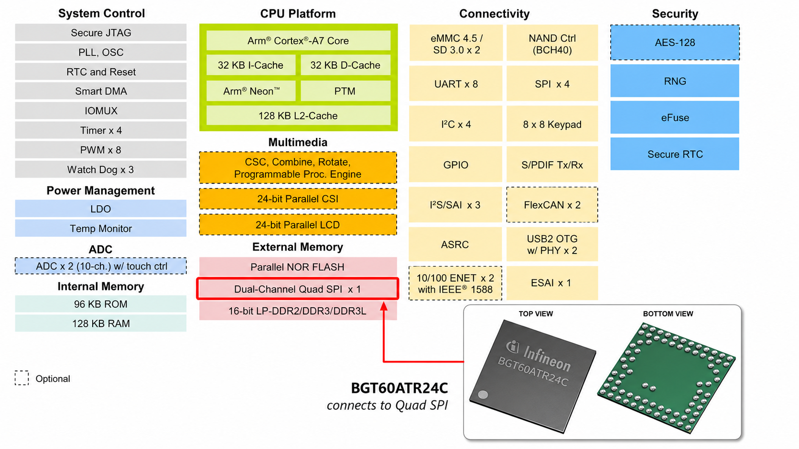

[中文](README.zh.md)

# Infineon BGT60ATR24C QSPI Driver Extension



## Layout

```
kernel/          driver sources
patches/         patch series 0001–0003
scripts/         apply-to-kernel.sh / generate-patches.py
tools/           userspace data capture tool
```

## Requirements

- Linux kernel: 4.1.x
- SoC: NXP i.MX6ULL

## Integration

**Option A — install via scripts:**

```bash
./scripts/apply-to-kernel.sh /path/to/linux-4.1.15
```

**Option B — merge via patches:**

```bash
cd /path/to/linux-4.1.15
patch -p1 < patches/0001-qspi-add-ip-op.patch
patch -p1 < patches/0002-bgt60atr24c-driver.patch
patch -p1 < patches/0003-dts-enable-bgt60.patch
```

## Kernel configuration

Enable at minimum:

```
CONFIG_SPI_FSL_QUADSPI=y
CONFIG_BGT60ATR24C=m
```

A ready-made fragment lives at `kernel/configs/bgt60_defconfig.fragment` (includes MTD/QSPI deps). Merge it into your kernel `.config`:

```bash
cd /path/to/linux-4.1.15
./scripts/kconfig/merge_config.sh -m .config /path/to/imx6ull-bgt60atr24c-qspi-driver/kernel/configs/bgt60_defconfig.fragment
make olddefconfig
```

## Device tree

```dts
#include "imx6ull-bgt60atr24c-qspi.dtsi"
```

See `infineon,bgt60atr24c.txt` for property descriptions.

## Build

```bash
make ARCH=arm CROSS_COMPILE=arm-linux-gnueabihf- modules
```

## Userspace interface

| Interface | Description |
|-----------|-------------|
| /dev/bgt60atr24c | read / poll / ioctl |
| sysfs | state, counters |
| uapi | kernel/include/uapi/linux/bgt60atr24c.h |
| ioctl | START/STOP/RECOVER/GET/SET_CFG/GET_COUNTERS/GET_INFO |

## Optional tool

From the repo: `cd tools && make` uses `kernel/include/uapi` for `linux/bgt60atr24c.h`. With a full kernel tree:

```bash
cd tools
make KERNEL_SRC=/path/to/linux-4.1.15
./bgt60_capture -n 10
```

## License

GPL-2.0

## Contact

E-mail: zhchen2000@foxmail.com

## Release notes

**2026-10-07** — Docs and sample-app build only; the driver and patches are the same. The README now walks through using the bundled kernel config snippet with your `.config`. The capture example used to fail on a dev PC because headers were missing—`make` under `tools/` should work after clone. On the board, you can still pass `KERNEL_SRC` if your kernel lives elsewhere.
